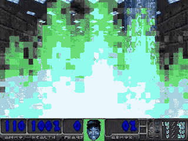

<p align="center">
  
</p>

<div align="center">

[Overview](#overview) · [Results](#results) · [Architecture](#architecture) · [Training](#training) · [Evaluate](#evaluate)

</div>

---

## Overview

A PPO-based agent for the [JKU Deep Reinforcement Learning](https://www.jku.at/) course challenge: survive and dominate a VizDoom deathmatch against 4 bots on the ROOM map. Submitted as an ONNX model (≤ 50 MB) evaluated by the grading server.

**Task setup:**
- 1 player vs 4 bots · ROOM map · `episode_timeout = 2000`
- `Discrete(8)` action space · `128×128` RGB observations
- Reward: `+2` per hit · `-0.1` per hit taken · `+100` per frag
- Deaths are **respawns** — the episode never terminates early

---

## Recorded Run



*Episode from early `impala_6M` checkpoint*

---

## Results

| Run | Steps | Server score | Key changes |
|---|---|---|---|
| `ppo_baseline` | 1M | — | NatureCNN, no extras |
| `impala_2M` | 2M | — | IMPALA encoder |
| `impala_4M_big` | 4M | — | + large rollout buffer (20k steps) |
| `impala_6M` | 6M | 490 | + reward norm, entropy anneal, KL stop |
| `impala_10M_death` | 10M | 483 | + death penalty (−10) |
| `impala_10M_stack4` | 10M | 420 | + frame stacking (n=4) |
| `impala_12M_death2` | 12M | 523 | + 12M steps, death penalty |
| `impala_12M_stack4_death2` | 12M | 480 | stack4 — ONNX conversion gap (−62 pts) |
| `impala_ft6M_base` | +6M fine-tune | **617** ✓ | warm-start, no death penalty, LR 10× lower |
| `impala_ft6M_alive` | +6M fine-tune | pending | + AliveReward (per-tick survival bonus) |

**Best submission:** `impala_ft6M_base` · server score **617**

---

## Architecture

**Encoder — IMPALA CNN** (2.2M params, 256-dim output)

```
Conv(in_ch → 16, 3×3) + MaxPool  →  64×64
  2 × ResBlock(16)
Conv(16 → 32, 3×3)   + MaxPool  →  32×32
  2 × ResBlock(32)
Conv(32 → 32, 3×3)   + MaxPool  →  16×16
  2 × ResBlock(32)
ReLU → Flatten → Linear(8192, 256)
```

**Actor-Critic heads** on top of the encoder, orthogonal init (policy gain=0.01, value gain=1.0).

**Training stabilisers:**
- Reward normalisation via Welford's online `RunningMeanStd`
- Entropy coefficient annealing `0.01 → 0.001`
- Value function clipping
- KL early stopping (`target_kl=0.01`)
- LR annealing with 10% floor
- Large CPU rollout buffer (20k steps) — stored on CPU, batched to GPU
- EMA best-checkpoint tracking — exports `submission.onnx` live during training

---

## Training

```bash
# Train from scratch
uv run scripts/train.py \
  --run-name my_run \
  --total-steps 12_000_000 \
  --n-steps 20000

# Fine-tune from a pretrained checkpoint (recommended)
uv run scripts/train.py \
  --run-name my_finetune \
  --total-steps 6_000_000 \
  --n-steps 20000 \
  --lr 2.5e-5 \
  --pretrain-checkpoint runs/impala_ft6M_base/ckpt_006000000.pt

# With alive reward (best training signal found)
uv run scripts/train.py \
  --run-name my_run \
  --total-steps 6_000_000 \
  --n-steps 20000 \
  --lr 2.5e-5 \
  --alive-reward \
  --pretrain-checkpoint runs/impala_ft6M_base/ckpt_006000000.pt
```

Key flags:

| Flag | Default | Description |
|---|---|---|
| `--total-steps` | 1M | Total environment steps |
| `--n-steps` | 512 | Rollout buffer size |
| `--n-stack-frames` | 1 | Frame stacking depth |
| `--encoder` | `impala` | `impala` or `nature` |
| `--lr` | 2.5e-4 | Initial learning rate |
| `--pretrain-checkpoint` | — | Warm-start from checkpoint (resets optimizer) |
| `--partial-load` | off | Skip mismatched layers (for architecture changes) |
| `--alive-reward` | off | Per-tick bonus for being alive (not respawning) |
| `--death-penalty` | off | Add penalty on death (deprecated — use alive-reward) |
| `--ent-coef-final` | 0.001 | Entropy annealing floor |
| `--no-reward-norm` | — | Disable reward normalisation |
| `--no-random-seeds` | — | Fix VizDoom spawn seed |

---

## Evaluate

```bash
# Clone with submodule and install
git clone --recurse-submodules <repo>
uv sync
echo "$PWD/jku.wad" > .venv/lib/python3.13/site-packages/jku_wad.pth

# Local evaluation (10 episodes)
uv run scripts/evaluate.py --checkpoint runs/<run>/ckpt_XXXXXXXXX.pt

# Server-equivalent evaluation (uses onnx2pytorch)
uv run resources/server_eval_doom.py --submission runs/<run>/submission.onnx

# Record a video of the best episode
uv run scripts/record.py --checkpoint runs/<run>/ckpt_XXXXXXXXX.pt --record-best
```

---

## Project Structure

```
DoomAgent/
├── src/doomagent/
│   ├── agents/          # PPOAgent (with warm-start + EMA checkpoint tracking)
│   ├── buffers/         # RolloutBuffer (PPO), ReplayBuffer (DQN)
│   ├── models/          # PPOActorCritic, DQNModel, IMPALAEncoder, NatureCNN
│   ├── utils/           # Logger, RunningMeanStd, ONNX export
│   ├── config.py        # PPOConfig, DQNConfig, EnvConfig
│   ├── env.py           # make_env()
│   └── reward.py        # CustomReward, AliveReward, DeathPenaltyReward
├── scripts/
│   ├── train.py         # PPO training entry point
│   ├── evaluate.py      # Local evaluation
│   └── record.py        # Video recording
├── resources/
│   ├── recorded_run.gif
│   └── server_eval_doom.py
├── RESEARCH_REPORT.md   # Detailed experiment log and findings
├── jku.wad/             # Git submodule — VizDoom environment
└── Note.md              # Experiment notes
```
